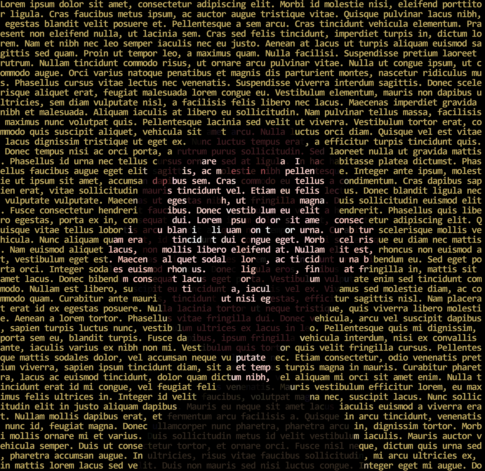

# Text art tool

This is a tool that takes some text and draws an image with that text.

I think it would be cool to make a movie poster using its screenplay, or an album cover using its lyrics.

## Example

This image above was made from this bunch of Lorem ipsum:

> Lorem ipsum dolor sit amet, consectetur adipiscing elit. Morbi id molestie nisi, eleifend porttitor ligula. Cras faucibus metus ipsum, ac auctor augue tristique vitae. Quisque pulvinar lacus nibh, egestas blandit velit posuere et. Pellentesque a sem arcu. Cras tincidunt vehicula elementum. Praesent non eleifend nulla, ut lacinia sem. Cras sed felis tincidunt, imperdiet turpis in, dictum lorem. Nam et nibh nec leo semper iaculis nec eu justo. Aenean at lacus ut turpis aliquam euismod sagittis sed quam. Proin ut tempor leo, a maximus quam. Nulla facilisi...

And my little picture of me:

